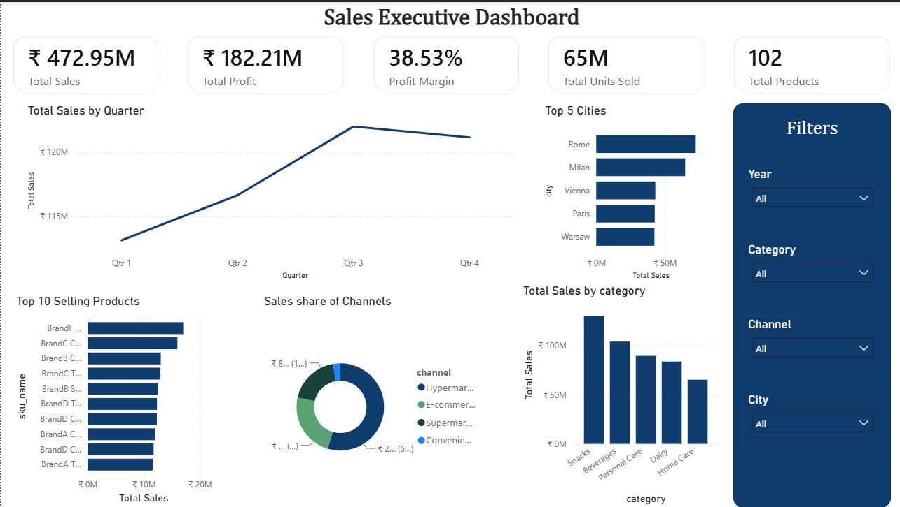

# 📊 Sales Executive Dashboard | Power BI

An interactive **Power BI Sales Executive Dashboard** built to analyze sales performance, profitability, products, channels, and cities using a retail sales dataset.

---

## 🖼️ Dashboard Preview



---

## 📌 Overview

This dashboard provides an executive-level overview of sales performance through interactive KPIs, charts, and filters. It enables users to monitor business performance and identify trends across different dimensions.

---

## 📈 Key Performance Indicators

- 💰 Total Sales
- 📊 Total Profit
- 📉 Profit Margin
- 📦 Total Products
- 🛒 Total Units Sold

---

## 📊 Visualizations

- Sales Trend by Quarter
- Top 5 Cities by Sales
- Top 10 Selling Products
- Sales by Category
- Sales Distribution by Channel

---

## 🎛️ Interactive Filters

- Year
- Category
- Channel
- City

---

## 🛠️ Tools & Technologies

- Power BI Desktop
- Power Query
- DAX
- Data Modeling
- Star Schema

---

## 📚 DAX Measures Used

- Total Sales
- Total Profit
- Profit Margin
- Total Products
- Total Units Sold

---

## 💡 Business Insights

- Snacks generated the highest sales among all product categories.
- Rome recorded the highest sales among the top five cities.
- Hypermarkets contributed the largest share of total sales.
- Overall profit margin is approximately **38.5%**.
- More than **65 million units** were sold across all products.

---

## 📂 Repository Contents

```text
├── Sales_Executive_Dashboard.pbix
├── README.md
└── Images
    └── dashboard.png
```

---

## 🚀 Skills Demonstrated

- Data Cleaning & Transformation
- Data Modeling (Star Schema)
- DAX Measure Development
- KPI Design
- Interactive Dashboard Design
- Business Intelligence Reporting

---

## 📬 Contact

**Shivam Chatterjee**

If you found this project interesting, feel free to connect with me on LinkedIn or explore my other repositories.
